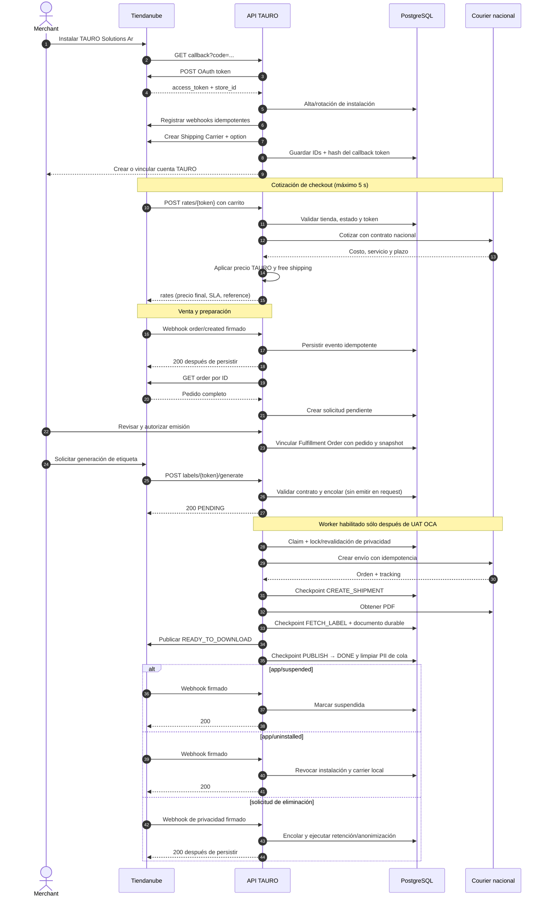

# Diagrama de secuencia · TAURO Solutions Ar

Este es el artefacto técnico base para homologación. No existe polling de
pedidos: la sincronización parte de webhooks.

El diagrama refleja el candidato local actual. La cotización y el flujo durable
de Labels están implementados, pero sus flags y el registro de
`callback_labels_url` permanecen bloqueados hasta completar credenciales QA,
aplicación de la migración ya validada sobre staging/base objetivo, UAT OCA y
aprobación operativa. El código listo no equivale a una integración desplegada
u homologada.

## Datos que no salen de TAURO

- Costo contractual del courier.
- Markup y reglas comerciales.
- Credenciales del courier.
- Client secret y access tokens de Tiendanube.
- Documentos o datos personales no necesarios para el checkout.
